# CBSE Architecture Guide: Complete Blockchain Symbolic Execution

## Overview

CBSE (Complete Blockchain Symbolic Executor) is a Rust-based symbolic execution engine for Ethereum smart contracts. It analyzes Solidity code by exploring all possible execution paths to find vulnerabilities, assertion failures, and edge cases that traditional testing might miss.

---

## Key Capabilities

- **Symbolic Execution**: Explores all code paths using symbolic values instead of concrete inputs
- **Automatic Bug Detection**: Finds overflows, underflows, assertion failures, and reverts
- **Path Exploration**: Discovers counterexamples that violate invariants
- **Dual Execution Modes**: Run locally or offload to remote cloud servers via SSH

---

## Core Philosophy

**Traditional Testing:**
```
test(5) ✓  test(10) ✓  test(100) ✓  ... (limited coverage)
```

**Symbolic Execution:**
```
test(X) where X ∈ [0, 2^256-1]  (complete coverage)
```

---

## Execution Modes

### 1. Local Mode (Default)

Execute everything on your local machine:

```bash
cbse --function "test"
```

**Use Cases:**
- Development and debugging
- Small to medium contracts
- Quick iteration cycles
- No network latency concerns

### 2. SSH Cloud Mode

Compile locally, execute remotely:

```bash
cbse --ssh --ssh-host node10@node10 --function "test"
```

**Use Cases:**
- Large contract suites requiring heavy computation
- Offloading Z3 solver work to powerful servers
- Parallel execution across multiple nodes (future)
- Resource-constrained local machines

---

## System Architecture Overview

```mermaid
graph TD
    A[Solidity Code - .sol files]
    A --> B[PHASE 1: COMPILATION - Always happens locally]
    B --> C[cbse-build - Forge Integration]
    C --> D[Build Artifact - • Bytecode - • ABI - • Storage - • Metadata]
    
    D --> E{Execution Mode?}
    
    E -->|Local| L1[LOCAL EXECUTION]
    E -->|SSH| S1[SSH CLOUD MODE]
    
    S1 --> S2[cbse-remote - SSH Upload]
    S2 --> S3[Remote Server - Worker Mode]
    
    L1 --> P2[PHASE 2: - SYMBOLIC EXECUTION]
    S3 --> P2
    
    P2 --> J[cbse-sevm - Symbolic EVM]
    J --> K[Path Exploration - • Fork on branch - • Track paths - • Collect traces]
    K --> L[cbse-solver Z3 - Constraint Solving]
    L --> M[Test Results - • Pass/Fail - • Traces - • Counterexample]
    
    M --> N1{Mode?}
    N1 -->|Local| N2[Display Locally - cbse-ui]
    N1 -->|SSH| N3[Download Results - cbse-remote]
    N3 --> N2
    
    style A fill:#e1f5ff
    style D fill:#fff4e1
    style P2 fill:#ffe1f5
    style M fill:#e1ffe1
    style N2 fill:#f0f0f0
```



---

## Execution Flow

### Phase 1: Compilation (Always Local)

```mermaid
graph TD
    U[User runs: cbse --function test]
    U --> C1[cbse-config - Parse CLI arguments]
    C1 --> B1[cbse-build executes - forge build --ast - --extra-output storageLayout]
    B1 --> F1[Forge compiles - Solidity contracts]
    F1 --> F2[test/Counter.t.sol → - out/Counter.t.sol/CounterTest.json]
    F2 --> F3[src/Counter.sol → - out/Counter.sol/Counter.json]
    F3 --> P1[cbse-build parses - JSON artifacts]
    P1 --> A1[BuildArtifacts struct - • abi: Array - • bytecode: Hex - • deployedBytecode: Hex - • storageLayout: Object - • metadata: Object]
    
    style U fill:#e1f5ff
    style A1 fill:#e1ffe1
```



---

### Phase 2A: Local Execution Flow


---

### Phase 2B: SSH Cloud Execution Flow

```mermaid
graph TD
    START[User runs: cbse --ssh - --ssh-host user@server - --function test]
    
    START --> LOCAL1[LOCAL: Compilation - Steps 1-3 same as local mode]
    
    LOCAL1 --> LOCAL2[LOCAL: cbse-remote - Create JobArtifact]
    
    LOCAL2 --> JOB[JobArtifact Structure: - • contracts array - • config object - • job_id uuid - • timestamp]
    
    JOB --> SERIAL[Serialize to - artifact.json]
    
    SERIAL --> CONN[LOCAL: Establish - SSH Connection - • Prompt for password - • TCP connection - • Authentication]
    
    CONN --> UPLOAD[LOCAL: SFTP Upload - artifact.json → - /tmp/cbse-jobs/uuid/]
    
    UPLOAD --> EXEC[LOCAL: Execute - Remote Command - /usr/local/bin/cbse - --worker-mode - --input artifact.json - --output result.json]
    
    EXEC --> REMOTE1[REMOTE: Worker Mode Starts]
    
    REMOTE1 --> REMOTE2[REMOTE: Deserialize - artifact.json]
    
    REMOTE2 --> REMOTE3[REMOTE: Initialize - Z3 Context]
    
    REMOTE3 --> REMOTE4[REMOTE: Execute Tests - Same as Local Phase 2A - Steps 2-4]
    
    REMOTE4 --> REMOTE5[REMOTE: Symbolic - Execution Loop - • Deploy contracts - • Execute functions - • Fork paths - • Check constraints - • Collect results]
    
    REMOTE5 --> REMOTE6[REMOTE: Serialize Results - to result.json]
    
    REMOTE6 --> RESULT[Result JSON: - • tests array - • passed boolean - • traces - • counterexamples - • summary]
    
    RESULT --> EXIT[REMOTE: Exit Worker - Code 0 pass or 1 fail]
    
    EXIT --> DOWNLOAD[LOCAL: SFTP Download - result.json from - /tmp/cbse-jobs/uuid/]
    
    DOWNLOAD --> CLEANUP[LOCAL: Remote Cleanup - rm -rf /tmp/cbse-jobs/uuid/]
    
    CLEANUP --> PARSE[LOCAL: Parse - result.json]
    
    PARSE --> DISPLAY[LOCAL: Display Results - cbse-ui - Same as local mode]
    
    style START fill:#e1f5ff
    style LOCAL1 fill:#e1f5ff
    style LOCAL2 fill:#e1f5ff
    style CONN fill:#fff4e1
    style UPLOAD fill:#ffe1f5
    style REMOTE1 fill:#ffe1e1
    style REMOTE2 fill:#ffe1e1
    style REMOTE3 fill:#ffe1e1
    style REMOTE4 fill:#ffe1e1
    style REMOTE5 fill:#ffe1e1
    style REMOTE6 fill:#ffe1e1
    style DOWNLOAD fill:#ffe1f5
    style DISPLAY fill:#e1ffe1
```



---

## Data Flow Diagrams

### Local Mode Data Flow (Vertical)

```mermaid
graph TD
    A[Solidity Source Files - .sol]
    
    A -->|cbse-build| B[BuildArtifacts]
    
    B1[BuildArtifacts Contents: - • bytecode: Vec u8 - • abi: Vec AbiItem - • storage: StorageLayout]
    B --> B1
    
    B1 -->|main.rs| C[Iterate Each Test Function]
    
    C -->|cbse-sevm| D[SEVM Initialization]
    
    D1[SEVM Components: - • Context Z3 - • State stack, memory, storage - • Contract bytecode]
    D --> D1
    
    D1 -->|cbse-calldata| E[Build Function Call]
    
    E1[Function Call: - • selector: u8; 4 - • args: Vec CbseBitVec]
    E --> E1
    
    E1 -->|cbse-sevm opcodes| F[Execution Loop]
    
    F --> G{Conditional Branch?}
    
    G -->|Yes| H[Path 1 - Constraints: - Vec Z3Bool]
    G -->|Yes| I[Path 2 - Constraints: - Vec Z3Bool]
    G -->|No| J[Continue Single Path]
    
    H -->|cbse-solver| K{SAT Check Path 1}
    I -->|cbse-solver| L{SAT Check Path 2}
    J -->|cbse-solver| M{SAT Check}
    
    K -->|SAT| N[Continue Path 1]
    K -->|UNSAT| O[Prune Path 1]
    
    L -->|SAT| P[Continue Path 2]
    L -->|UNSAT| Q[Prune Path 2]
    
    M -->|SAT| R[Continue]
    M -->|UNSAT| S[Prune]
    
    N -->|cbse-traces| T[Trace Recording]
    P -->|cbse-traces| T
    R -->|cbse-traces| T
    
    T1[Trace Events: - • CALL - • SLOAD - • SSTORE - • REVERT]
    T --> T1
    
    T1 -->|main.rs| U[TestResult]
    
    U1[TestResult: - • passed: bool - • trace: String - • counterexample: Option Model]
    U --> U1
    
    U1 -->|cbse-ui| V[Terminal Output - Formatted Display]
    
    style A fill:#e1f5ff
    style B1 fill:#fff4e1
    style D1 fill:#ffe1f5
    style E1 fill:#e1ffe1
    style G fill:#ffcccc
    style K fill:#fff4e1
    style L fill:#fff4e1
    style M fill:#fff4e1
    style T1 fill:#e1f5ff
    style U1 fill:#ffe1e1
    style V fill:#e1ffe1
```



---

### SSH Cloud Mode Data Flow (Vertical)

```mermaid
graph TD
    subgraph LOCAL[" "]
        A[Solidity Source - Local Machine]
        A --> B[cbse-build - Compilation]
        B --> C[BuildArtifacts - Local]
        C --> D[cbse-remote - Job Creation]
        D --> E[JobArtifact Object - • contracts - • config - • metadata]
        E --> F[Serialize to - artifact.json]
        F --> G[SFTP Upload - SSH Connection]
    end
    
    G -.Transfer.-> H
    
    subgraph REMOTE[" "]
        H[artifact.json - Remote Server]
        H --> I[cbse --worker-mode - Deserialize]
        I --> J[Initialize - Z3 Context]
        J --> K[cbse-sevm - Execution Loop]
        K --> L[Path Exploration - Fork & Track]
        L --> M[cbse-solver - Constraint Solving]
        M --> N[Collect Results - Traces & Counterexamples]
        N --> O[Serialize to - result.json]
    end
    
    O -.Transfer.-> P
    
    subgraph LOCAL2[" "]
        P[SFTP Download - result.json]
        P --> Q[JobResult Object - Local Machine]
        Q --> R[Parse Results - Test Outcomes]
        R --> S[cbse-ui - Terminal Display]
        S --> T[Formatted Output - • Passed Tests - • Failed Tests - • Counterexamples - • Summary]
    end
    
    style A fill:#e1f5ff
    style C fill:#fff4e1
    style E fill:#ffe1f5
    style G fill:#ffcccc
    style H fill:#ffe1e1
    style K fill:#ffe1e1
    style M fill:#ffe1e1
    style O fill:#ffcccc
    style P fill:#e1ffe1
    style S fill:#e1f5ff
    style T fill:#ccffcc
```



---

## Worker Mode JSON Structure

### artifact.json (Uploaded to Remote)

```json
{
  "contracts": [
    {
      "name": "Counter",
      "bytecode": "0x608060405234801561001057600080fd5b50...",
      "abi": [
        {
          "type": "function",
          "name": "increment",
          "inputs": [],
          "outputs": []
        }
      ],
      "test_functions": ["test_Increment", "testFuzz_SetNumber"]
    }
  ],
  "config": {
    "verbosity": 3,
    "debug": false,
    "print_setup_states": false,
    "print_traces": true,
    "solver_timeout_ms": 30000,
    "solver_max_memory": 8192,
    "loop_bound": 3,
    "width_bound": 5,
    "depth_bound": 100,
    "array_lengths": null,
    "symbolic_storage": false,
    "symbolic_msg_sender": false
  },
  "job_id": "a1b2c3d4-e5f6-7890-abcd-ef1234567890",
  "timestamp": "2025-11-07T10:30:15Z"
}
```

### result.json (Downloaded from Remote)

```json
{
  "tests": [
    {
      "name": "CounterTest::test_Increment()",
      "passed": true,
      "gas_used": 0,
      "return_data": "",
      "trace": "CALL 0xabcd1234::0x273a7c12() (caller: 0x12345678)\n↩ RETURN 0x",
      "counterexample": null
    },
    {
      "name": "CounterTest::testFuzz_SetNumber(uint256)",
      "passed": false,
      "gas_used": 0,
      "return_data": "0x4e487b71...",
      "trace": "CALL 0xabcd1234::0xabc12345() (caller: 0x12345678)\n↩ REVERT 0x4e487b71...",
      "counterexample": {
        "x": "115792089237316195423570985008687907853269984665640564039457584007913129639935"
      }
    }
  ],
  "summary": {
    "total": 2,
    "passed": 1,
    "failed": 1,
    "execution_time_ms": 4523
  }
}
```

---

## User Guide

### Installation

#### Prerequisites

```bash
# Install Rust
curl --proto '=https' --tlsv1.2 -sSf https://sh.rustup.rs | sh

# Install Foundry (for Forge)
curl -L https://foundry.paradigm.xyz | bash
foundryup

# Install Z3 SMT Solver
# macOS:
brew install z3

# Ubuntu/Debian:
sudo apt-get install z3 libz3-dev

# Fedora:
sudo dnf install z3 z3-devel
```

#### Build CBSE

```bash
git clone https://github.com/leojay-net/FM-Rust-Cloud.git
cd FM-rust-cloud
cargo build --release
cargo install --path crates/cbse
```

---

### Local Execution

#### Basic Usage

```bash
# Navigate to your Foundry project
cd my-project

# Run all tests
cbse --function "test"

# Run specific test
cbse --function "testFuzz_SetNumber"

# Run with verbose output
cbse --function "test" -vvv

# Run with debugging
cbse --function "test" --debug --print-traces
```

#### Configuration Options

```bash
# Solver settings
cbse --function "test" \
  --solver-timeout-ms 60000 \
  --solver-max-memory 16384

# Exploration bounds
cbse --function "test" \
  --loop 5 \
  --width 10 \
  --depth 200

# Symbolic configuration
cbse --function "test" \
  --symbolic-storage \
  --symbolic-msg-sender

# Array lengths
cbse --function "test" \
  --array-lengths "MyArray=5,OtherArray=10"
```

---

### SSH Cloud Execution

#### Setup Remote Server

```bash
# 1. SSH into your remote server
ssh user@remote-server

# 2. Install dependencies
sudo apt-get update
sudo apt-get install -y build-essential pkg-config libssl-dev z3 libz3-dev clang

# 3. Install Rust
curl --proto '=https' --tlsv1.2 -sSf https://sh.rustup.rs | sh
source $HOME/.cargo/env

# 4. Clone and install CBSE
git clone https://github.com/leojay-net/FM-Rust-Cloud.git
cd FM-rust-cloud
cargo install --path crates/cbse

# 5. Create symlink (optional)
sudo ln -s ~/.cargo/bin/cbse /usr/local/bin/cbse

# 6. Verify installation
cbse --version
```

#### Run Tests on Remote Server

```bash
# From your local machine
cd my-project

# Run on remote server
cbse --ssh --ssh-host user@remote-server --function "test"

# With custom port
cbse --ssh --ssh-host user@remote-server --ssh-port 2222 --function "test"

# With verbose output
cbse --ssh --ssh-host user@remote-server --function "test" -vvv

# All configuration options work with SSH
cbse --ssh --ssh-host user@remote-server \
  --function "test" \
  --solver-timeout-ms 120000 \
  --loop 10 \
  --debug
```

---

### How SSH Mode Works (Step by Step)


**Advantages:**
- No need to sync source code to remote
- No need to install Forge on remote
- Only bytecode is transferred (small payload)
- Full config control from local CLI
- Results displayed locally with same UI

---

### Monitoring Remote Execution

On the remote server, you can monitor CBSE execution:

```bash
# Monitor active processes
watch -n 1 'ps aux | grep cbse'

# Monitor job directories
watch -n 1 'ls -lh /tmp/cbse-jobs/'

# View logs (if CBSE is verbose)
tail -f /tmp/cbse-jobs/*/output.log
```

---

## Example Workflow: Finding a Bug in SimpleVault

### Contract Code

```solidity
// src/SimpleVault.sol
contract SimpleVault {
    mapping(address => uint256) public balances;

    function deposit() external payable {
        balances[msg.sender] += msg.value;
    }

    function withdraw(uint256 amount) external {
        require(balances[msg.sender] >= amount, "Insufficient balance");
        balances[msg.sender] -= amount;  // BUG: Should happen AFTER transfer
        payable(msg.sender).transfer(amount);
    }
}
```

### Test Code

```solidity
// test/SimpleVault.t.sol
contract SimpleVaultTest is Test {
    SimpleVault vault;

    function setUp() public {
        vault = new SimpleVault();
    }

    function testWithdraw(uint256 depositAmount, uint256 withdrawAmount) public {
        vm.assume(depositAmount > 0);
        vm.assume(withdrawAmount > 0);
        
        vault.deposit{value: depositAmount}();
        vault.withdraw(withdrawAmount);
        
        // This should hold, but CBSE will find a counterexample
        assert(address(vault).balance >= 0);
    }
}
```

---

### Local Execution Output

```
$ cbse --function "testWithdraw" -vvv

   ╔═══════════════════════════════════════════╗
   ║  CBSE - Complete Blockchain Symbolic     ║
   ║         Executor (Rust Edition)           ║
   ╚═══════════════════════════════════════════╝

  Executing testWithdraw(uint256,uint256)
    
    ✗ Counterexample found!
    
    Symbolic inputs:
      depositAmount = 100
      withdrawAmount = 200
    
    Trace:
    CALL SimpleVault::deposit() value=100
      SSTORE balances[caller] = 100
    ↩ RETURN
    
    CALL SimpleVault::withdraw(200)
      SLOAD balances[caller] → 100
      ✓ require(100 >= 200)  ← FAILS
    ↩ REVERT "Insufficient balance"

Summary: 1 test, 0 passed, 1 failed
```

---

### SSH Execution Output (Same Contract)

```
$ cbse --ssh --ssh-host compute-node --function "testWithdraw" -vvv

Running in SSH mode (remote execution)
Enter SSH password: ****
🔌 Connecting to compute-node:22...
✅ SSH connection established
📤 Uploading artifacts...
⚙️  Executing CBSE on remote node...

📋 Remote output:
   ╔═══════════════════════════════════════════╗
   ║  CBSE - Complete Blockchain Symbolic     ║
   ║         Executor (Rust Edition)           ║
   ╚═══════════════════════════════════════════╝

  Executing testWithdraw(uint256,uint256)
    
    ✗ Counterexample found!
    
    Symbolic inputs:
      depositAmount = 100
      withdrawAmount = 200
    
    [... same trace as local ...]

📥 Downloading results...
✅ Remote execution complete in 3.45s

Summary: 1 test, 0 passed, 1 failed
```

**Identical results!** The only difference is where Z3 solver runs.

---

## Summary

CBSE provides two execution modes for Ethereum symbolic execution:

### Local Mode
- **Best for**: Development, debugging, small contracts
- **Requires**: Rust, Forge, Z3
- **Runs**: Everything on your machine

### SSH Cloud Mode
- **Best for**: CI/CD, large contracts, resource-limited local machines
- **Requires**: Rust + Forge locally, CBSE + Z3 on remote
- **Runs**: Compile locally, execute remotely

This design allows local-first development with optional cloud offloading for heavy workloads.

---

